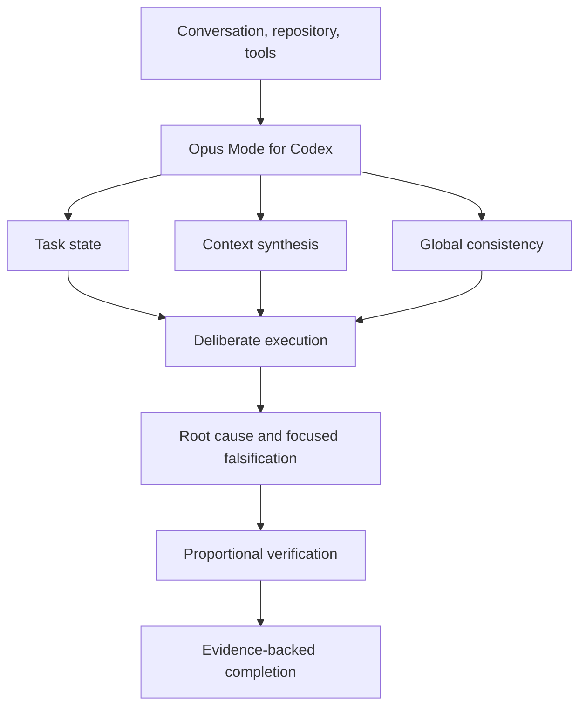

# Opus Mode for Codex

**Bring long-horizon reasoning habits to Codex.**

A lightweight Agent Skill for long-running, context-heavy tasks: preserve earlier
decisions, integrate changes across files, investigate root causes, and verify
the outcome before calling the work done.

**It does not run Claude, call Anthropic, or replace Codex.** "Opus Mode" names
a working style inspired by long-horizon agent behaviors, not a model switch.
This is an independent community project, unaffiliated with OpenAI or Anthropic.

[Read the skill](SKILL.md) · [Try a reproducible task](examples/baseline-vs-opus-mode.md) ·
[Evaluation protocol](benchmarks/README.md) · [MIT license](LICENSE)

## Quick start

Requires Git and a Codex client with local Agent Skills support. No runtime
dependencies, API keys, MCP servers, or installer scripts are added by this skill.
Normal Codex account requirements still apply.

For a personal installation, clone the release into Codex's local skills folder:

**macOS / Linux**

```sh
mkdir -p "$HOME/.agents/skills"
git clone --branch v0.1.0 --depth 1 https://github.com/ncusspm25/opus-mode-for-codex.git "$HOME/.agents/skills/opus-mode-for-codex"
```

**Windows PowerShell**

```powershell
New-Item -ItemType Directory -Force -Path "$HOME/.agents/skills" | Out-Null
git clone --branch v0.1.0 --depth 1 https://github.com/ncusspm25/opus-mode-for-codex.git "$HOME/.agents/skills/opus-mode-for-codex"
```

These commands require the destination not to exist. Review the repository
before loading it and follow any local installation or security policy. If your
policy requires scanning before installation, first clone into a staging folder,
scan it, then copy the reviewed folder into the skills location and scan again.

In Codex CLI or the IDE extension, type `$` or open `/skills`, then select the
skill. Restart Codex if it does not appear. Try:

```text
Use $opus-mode-for-codex.

Continue debugging this issue from our previous work.
Preserve earlier conclusions, identify the actual root cause,
make the smallest coherent change, and verify the result.
```

For one project only, place the same folder at
`.agents/skills/opus-mode-for-codex/` in that project. A manual copy needs
`SKILL.md`, `references/`, and optionally `agents/`; copying the whole repository
also works. Do not install both copies unless you intend duplicate skill entries.

Codex also supports asking its built-in installer to install from GitHub:

```text
Use $skill-installer to install the skill at
https://github.com/ncusspm25/opus-mode-for-codex/tree/v0.1.0
```

That is a natural-language installer request, not a shell command. The direct
folder installation is the independently validated path for this release; the
built-in installer route has not been tested here. See
[OpenAI's skills documentation](https://learn.chatgpt.com/docs/build-skills)
and the [validation record](references/validation.md) for scope and limitations.

## Why this exists

Codex is already capable of complex engineering work. This project explores a
more specific hypothesis: some failures in long tasks come from execution habits
such as losing a constraint, settling on a plausible explanation, or treating an
edit as a finished outcome. A reusable skill may help keep those habits explicit.

The skill keeps a small working model of the task, reconciles new evidence with
earlier decisions, searches the relevant consistency boundary, and scales checks
to the consequences of being wrong. It does not require a plan, approval request,
or exhaustive test suite for every action.

### Intended behavior, not measured superiority

These are failure patterns the skill targets, not claims about how baseline
Codex always behaves. **No controlled baseline-versus-skill benchmark results
are published for v0.1.0.** A smoke test is not evidence of a quality improvement.

| Area | Possible failure pattern | Intended habit |
| --- | --- | --- |
| Long context | Accumulate history; forget a decision | Maintain compact working state |
| Debugging | Stop at the first plausible cause | Trace the first divergence |
| Shared changes | Fix one caller; break another | Preserve the relevant invariants |
| Review | Accept the first solution | Try one meaningful counterexample |
| Verification | Stop after editing | Check in proportion to the risk |
| Completion | Report implementation as success | Report the outcome and evidence |



## Where it helps

**Long debugging.** A worker fails in module C, but module A converted the string
`"false"` to a truthy value. Trace that divergence before adding a guard in C.

```text
Possible shortcut: plausible cause -> patch -> one passing test -> done

Intended approach: recover state -> trace divergence -> check shared behavior
                   -> minimal fix -> targeted checks -> challenge the result
```

The arrows describe a debugging example, not mandatory steps for every task.
See the [long debugging scenario](examples/long-debugging-session.md).

**Multi-file changes.** A feature flag has different meanings in the HTTP service
and a background worker. Find both consumers and preserve the public API while
normalizing behavior. See [multi-file refactoring](examples/multi-file-refactor.md).

**Conversation continuation.** "Do not change the external API" remains active
twenty messages later. Recover that constraint, retain verified progress, and
continue from the current artifact. See [continuation](examples/long-conversation-continuation.md).

**Research.** A newer primary source contradicts an earlier assumption. Revise
the conclusion and the decisions that depended on it instead of appending one
more link. See [research synthesis](examples/research-and-analysis.md).

All narrative examples are illustrative. The
[runnable comparison task](examples/baseline-vs-opus-mode.md) separates a seeded
bug, evaluation criteria, and actual run records.

## When NOT to use this

Skip it for typo fixes, simple translations, formatting, obvious one-line changes,
simple rewrites, and simple questions. Extra deliberation can cost more than it
helps. Even explicit invocation should keep a trivial task short.

## Boundaries and control

This is text guidance, not persistent memory, an autonomous supervisor, a model
router, or a guarantee of correctness. It cannot recover unavailable conversation
history or enforce instructions mechanically. Benefits and overhead depend on
the task, model, context, and existing instructions.

The description permits implicit selection for complex work and discourages it
for trivial work. For explicit-only use, add this to the installed
`agents/openai.yaml`:

```yaml
policy:
  allow_implicit_invocation: false
```

Local `AGENTS.md`, user preferences, and approval policies remain in effect;
installation does not authorize actions. To disable or remove the skill, use
the local skill controls described in the official documentation, or move this
skill's folder outside the discovery paths. No other project files need changing.

## Evaluate and contribute

Try the same task with and without the skill, keep model and effort constant,
and include the failures as well as successes. Track forgotten constraints,
regressions, repeated investigation, completion accuracy, human corrections,
latency, and token usage when available.

Start with the [benchmark protocol](benchmarks/README.md) and
[contribution guide](CONTRIBUTING.md). Useful reports include a reproducible task,
the exact skill version, and observable evidence. A report that the skill adds
overhead without helping is valuable too.

Maintainers: [release history](CHANGELOG.md), [design rationale](references/design-principles.md),
and [launch drafts](launch/launch-checklist.md).
