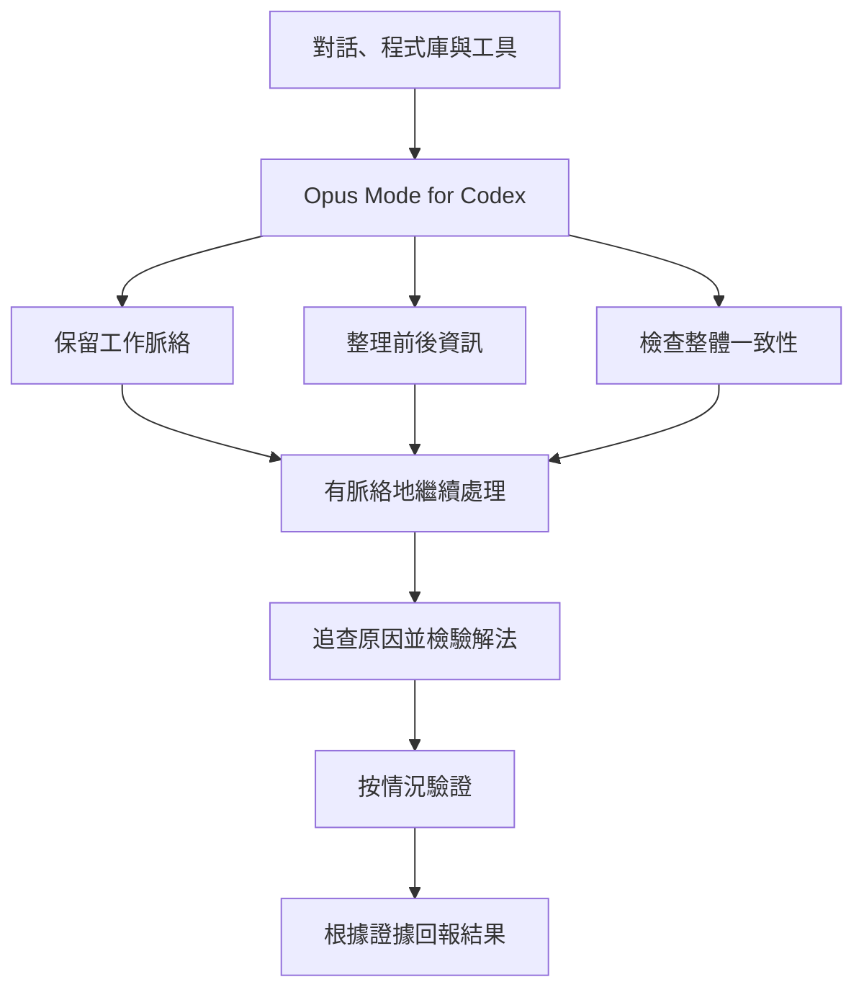

# Opus Mode for Codex

[English](README.md) · [繁體中文](README.zh-TW.md)

**讓 Codex 處理長任務時，記得前面已經確認過什麼。**

這是一個輕量的 Codex Agent Skill，適合需要多輪處理、跨檔案修改或整合大量脈絡的工作。它提醒 Codex 留住重要決定、追查問題的起因，也要確認結果真的通過檢查再回報完成。

**它不會執行 Claude、不會呼叫 Anthropic，也不會取代 Codex。**「Opus Mode」指的是一套工作習慣，不是切換模型。本專案由社群獨立維護，與 OpenAI、Anthropic 均無隸屬關係。

[閱讀 Skill](SKILL.md) · [試跑除錯範例](examples/baseline-vs-opus-mode.md) · [評估方法](benchmarks/README.md) · [MIT 授權](LICENSE)

## 快速安裝

需要 Git，以及支援本機 Agent Skills 的 Codex。這個 Skill 沒有額外的執行環境需求，不會安裝套件、要求 API 金鑰或連接 MCP 伺服器。Codex 本身的帳號需求仍適用。

**macOS／Linux**

```sh
mkdir -p "$HOME/.agents/skills"
git clone --branch v0.1.0 --depth 1 https://github.com/ncusspm25/opus-mode-for-codex.git "$HOME/.agents/skills/opus-mode-for-codex"
```

**Windows PowerShell**

```powershell
New-Item -ItemType Directory -Force -Path "$HOME/.agents/skills" | Out-Null
git clone --branch v0.1.0 --depth 1 https://github.com/ncusspm25/opus-mode-for-codex.git "$HOME/.agents/skills/opus-mode-for-codex"
```

目的地必須尚未存在。安裝前，先看看倉庫內容是否符合你的需要；若你的環境要求先掃描下載內容，請先複製到暫存目錄，掃描通過後再放進 Skills 資料夾，並依規定再次掃描。

在 Codex CLI 或 IDE 擴充功能中輸入 `$`，或開啟 `/skills`，就能找到這個 Skill。如果清單沒有出現，重新啟動 Codex 再試。

```text
使用 $opus-mode-for-codex。

請接著我們先前的除錯工作往下查。
保留已確認的結論，找出真正原因，只做必要的修改，並驗證結果。
```

只想在單一專案使用時，把 Skill 資料夾放在該專案的 `.agents/skills/opus-mode-for-codex/`。手動安裝至少要有 `SKILL.md` 和 `references/`；`agents/` 裡的顯示資訊則是選用。直接複製整個倉庫也可以。請勿同時安裝兩份，否則清單裡可能會看到重複項目。

也可以請 Codex 的內建安裝工具從 GitHub 安裝：

```text
請用 $skill-installer 安裝這個 Skill：
https://github.com/ncusspm25/opus-mode-for-codex/tree/v0.1.0
```

這是給 Codex 的指令，不是終端機命令。目前實際驗證過的是直接複製 Skill 資料夾的方法，內建安裝工具尚未測試。詳細相容性與測試結果請見[官方 Skills 說明](https://learn.chatgpt.com/docs/build-skills)和[驗證紀錄](references/validation.md)。

## 為什麼做這個 Skill

Codex 已經能做不少複雜工作，但長任務仍可能遇到一些熟悉的狀況：前面交代過的限制後來忘了、先看到一個說得通的原因就急著修改，或改完之後沒有確認結果就說「修好了」。

這個專案想試試看，把幾個工作習慣寫成可重複使用的 Skill，能不能減少這些疏漏。它會在複雜任務中留下精簡的工作脈絡、對照新舊證據、檢查共享行為牽涉到的其他地方，再依風險決定要做哪些驗證；小事則照樣快速處理，不多加儀式。

### 設計方向，不代表實測結果

下表列的是這個 Skill 想改善的情況，**不是對 Codex 預設行為的統計，也不是效能保證**。截至 v0.1.0，尚未完成對照實驗來證明使用 Skill 後品質有所提升。一次 smoke test 也不能證明實際效果。

| 情境 | 複雜任務中可能遇到的問題 | 希望養成的習慣 |
| --- | --- | --- |
| 長對話 | 討論很多，重要決定卻被埋掉 | 留下精簡而有用的工作脈絡 |
| 除錯 | 找到一個說得通的原因就停下來 | 找到實際開始出錯的位置 |
| 跨檔案修改 | 這裡修好，另一個使用者卻壞了 | 一起檢查相關部分是否一致 |
| 檢查成果 | 第一個能跑的解法就直接採用 | 找一個有意義的反例測試它 |
| 驗證 | 寫完程式就當作完成 | 按風險確認該確認的項目 |
| 回報 | 有改程式就說已完成 | 交代結果和實際檢查的證據 |



## 哪些工作適合使用

**長時間除錯：**背景工作程式在 C 模組出錯，實際原因卻是 A 模組把字串 `"false"` 當成真值。先追出值在哪裡變了，再決定要修哪裡；只在 C 多加一道檢查，可能只是暫時遮住症狀。

```text
容易跳過的步驟：看到可能的原因 → 馬上修改 → 跑一個測試 → 結束

在複雜除錯中可以多想一步：接續先前調查 → 找出最早出錯的位置
                         → 檢查相關使用處 → 最小修改 → 驗證與反向檢查
```

這是除錯情境的示意，不是每次工作都得照做的固定流程。更多內容請看[長時間除錯範例](examples/long-debugging-session.md)。

**多檔案修改：**HTTP 服務和背景工作程式對同一個功能旗標有不同解讀。修改之前先找出兩邊的使用處，確認原有 API 和共同約定不會被破壞。詳見[跨檔案重構範例](examples/multi-file-refactor.md)。

**接續先前的對話：**使用者前面說過「不要改外部 API」，後面的解法即使改 API 比較簡單，這項限制仍然有效。先從目前進度接著做，也不要無故重查已經排除的方向。詳見[延續長對話範例](examples/long-conversation-continuation.md)。

**研究整理：**後來查到的新一手資料和舊假設不一致，應該回頭更新結論和相關建議，而不是只在舊答案後面再多貼一個連結。詳見[研究範例](examples/research-and-analysis.md)。

以上是情境說明，並非真實的模型比較紀錄。想自己試的話，可以用這份[可重現的比較題目](examples/baseline-vs-opus-mode.md)：它附有帶錯誤的範例程式、驗收測試，也說明如何記錄實際結果。

## 哪些情況不需要

改錯字、簡單翻譯、排版、一眼就能完成的單行修改或簡單問答，都不必多花時間分析。就算手動叫出這個 Skill，也應直接把這種小事做好。

## 使用範圍

這個 Skill 是一份文字指引。它本身不提供跨工作階段的記憶、不會在背景監督 Codex、不會切換模型，也不能保證每次都正確。能不能改善工作成果，仍取決於任務、模型、可用脈絡和既有指示。

Skill 描述會讓 Codex 有機會依任務內容自動選用。如果你偏好每次自己呼叫，可以在安裝後的 `agents/openai.yaml` 加上：

```yaml
policy:
  allow_implicit_invocation: false
```

你原本的 `AGENTS.md`、個人偏好和核准政策仍然有效。安裝這個 Skill 不會額外賦予 Codex 權限。停用或移除方式請參考 [OpenAI 官方說明](https://learn.chatgpt.com/docs/build-skills)，或把 Skill 資料夾移出 Codex 會搜尋的位置。

## 評估與參與

如果想知道它是否真的有幫助，請用相同模型和 effort 比較「沒有安裝」與「有安裝」的結果，成功和失敗都記錄下來。可以留意限制是否被忘記、改動有沒有造成回歸、調查是否重複、驗證是否足夠，以及所花時間、人工修正次數和可取得的 token 用量。

先看[benchmark 評估方法](benchmarks/README.md)和[貢獻指南](CONTRIBUTING.md)。回報時請附上可重現的任務、實際 Skill 版本和觀察到的證據。若結果顯示這個 Skill 只是增加工時，也很值得分享。

維護者可參考[更新紀錄](CHANGELOG.md)、[設計原則](references/design-principles.md)和[發布草稿](launch/launch-checklist.md)。
